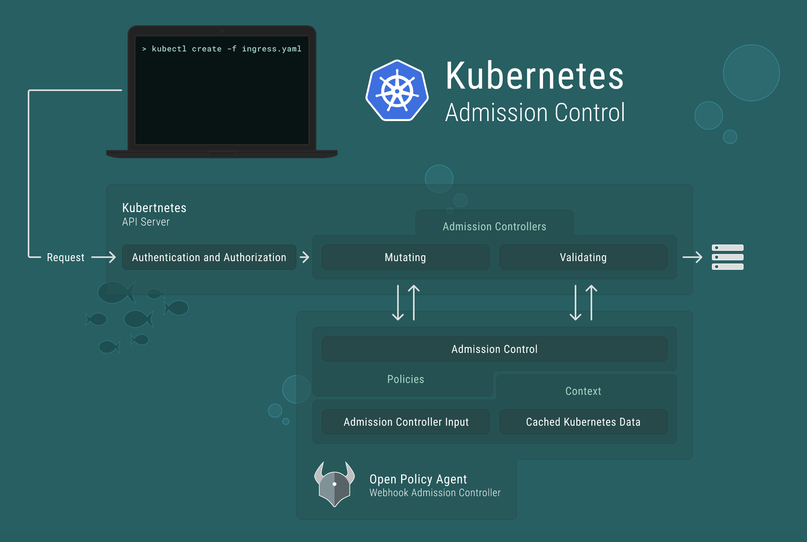

## Policy as Code

### Why you should, how you can

Olly Stephens, Tech Exeter 2019

---

@snap[north-west span-50]
### Agenda

- Scene setting
- A quick introduction to [Open Policy Agent](https://www.openpolicyagent.org/)
- OPA at run time examples
- Shift-left testing
- OPA at build time examples
@snapend

@snap[north-east span-50]
### About Me

- Architect; Technologist; Gopher
- Head of Platform Engineering at Adarga Ltd
- Self-confessed giant shoulder standerer
- _(today's thanks go to Gareth Rushgrove)_
@snapend

---

## Congratulations

You've worked really hard and you now have a rock solid [Infrastructure as Code](https://en.wikipedia.org/wiki/Infrastructure_as_code) setup.
No more snowflakes; no more point-and-click configuration.
You rely on [Terraform](https://www.terraform.io/) and
[Kubernetes](https://kubernetes.io/) manifests to build your entire tech stack.
It's done declaratively - you specify what it should look like and the tooling makes it happen. Life is good.

---

### And - somewhere - we have some policies written down


---

## But where are the guard rails?

- Don't do stupid things
- Follow our in-house conventions

---

# Open Policy Agent

A policy enforcement engine for configuration

---


---

### The REGO Language

@ul[zoom-07]
- OPA is purpose built for reasoning about information represented in structured documents. The data that your service and its users publish can be inspected and transformed using OPA’s native query language Rego.

- Rego was inspired by Datalog, which is a well understood, decades old query language. Rego extends Datalog to support structured document models such as JSON.

- Rego focuses on providing powerful support for referencing nested documents and ensuring that queries are correct and unambiguous.

- Rego is declarative so policy authors can focus on what queries should return rather than how queries should be executed. These queries are simpler and more concise than the equivalent in an imperative language.
@ulend

---

## Kubernetes Example

@fa[quote-left] Developers are not allowed to create public facing services in the DEV kube cluster @fa[quote-right]

---



---

@snap[north span-100]
@code[ruby](gatekeeper/only-internal-lbs.rego)
@snapend

@snap[south span-100]
@[3,6,7, zoom-10](If we are creating or updating a Service.)
@[8,     zoom-10](And it's type is LoadBalancer.)
@[9,10,  zoom-10](And it doesn't have this annotation.)
@[5,11,  zoom-10](Then deny the request.)
@snapend

---

## Kubernetes Example

@fa[quote-left] Ingress names must be whitelisted @fa[quote-right]

---

@snap[north span-100]
@code[ruby](gatekeeper/whitelist-ingress.rego)
@snapend

@snap[south span-100]
@[10,11, zoom-100](Is the host name whitelisted?)
@[16,17, zoom-100](Whitelisted names are attached to namespace)

---

# Shift Left

Shift-left testing is an approach to software testing and system testing in which testing is performed earlier in the lifecycle (i.e., moved left on the project timeline). It is the first half of the maxim "Test early and often."
[Wikipedia](https://en.wikipedia.org/wiki/Shift-left_testing)

---

## Let's shift left ever so slightly...


---

# conftest

Write tests against structured configuration data using the Open Policy Agent Rego query language.

---

### conftest

@ul[zoom-07]
- conftest allows you to write policies using Open Policy Agent/rego and apply them to one or more configuration files.
- As of today conftest supports:
  - YAML
  - JSON
  - INI
  - TOML
  - HCL
  - CUE
  - Dockerfile
@ulend

---

### Can still check our kubernetes manifests

@code[ruby](conftest/kubernetes/policy/run-as-non-root.rego)

---

### and...

@code[ruby](conftest/kubernetes/policy/must-have-labels.rego)

---

@snap[north span-100]

### but this time, we do it before we push

#### (as part of a test for a continuous deployment trigger)

@snapend

@snap[zoom-08 code-max]
```bash
% conftest test ./bad-deploy.yaml && echo OK
FAIL - ./bad-deploy.yaml - Deployment 'tokenizer' must include standard labels
FAIL - ./bad-deploy.yaml - Containers in deployment 'tokenizer' must not run as root

% conftest test ./good-deploy.yaml && echo OK
OK
```
@snapend

---

## Terraform Example

@fa[quote-left] All AWS assets (that support it) must have a `cost_code` tag set. @fa[quote-right]

---

@snap[north span-100]
@code[ruby zoom-08](conftest/terraform/policy/cost-codes.rego)
@snapend

@snap[south span-100]
@[13,         zoom-10](There exists some value of i)
@[3-10,15-16, zoom-10](that is an instance of a resource that supports tags)
@[17,         zoom-10](that does not have cost_code in the set of tags after apply)
@snapend

---

#### ...with a little hoop jumping

```bash
% terraform plan -out tfplan
% terraform show -json tfplan | conftest test -
FAIL - aws_internet_gateway.my-vpc-igw does not have cost_code tag
FAIL - aws_vpc.my-vpc does not have cost_code tag
```

---

## More Terraform

@fa[quote-left] Control blast radius to protect against catastrophic deployments @fa[quote-right]

---

@code[ruby code-max zoom-06](conftest/terraform/policy/blast-radius-core.rego)

---

### Moving back from CD to CI


---

## Snyk
### (vulnerability scanning)

@fa[quote-left] All high severity vulnerabilities left in code must be formally waived by CISO @fa[quote-right]

---

@snap[north span-85]
Snyk policy file
@code[yaml zoom-05 code-max](conftest/snyk/example.snyk?lines=1-12)
--
Synk policy file policy
@code[ruby zoom-05 code-max](conftest/snyk/policy/waivers.rego)
@snapend

---

## Service Config
### (grafana.ini example)

---

@snap[north span-85]
`grafana.ini`
@code[ini zoom-05 code-max](conftest/grafana/grafana.ini)
--
Policy file
@code[ruby zoom-05 code-max](conftest/grafana/policy/grafana.rego)
@snapend

---

```bash
% conftest test grafana.ini
FAIL - grafana.ini - Alerting should turned on
FAIL - grafana.ini - Grafana port should be 3443
FAIL - grafana.ini - Grafana should use default https
FAIL - grafana.ini - Users should verify their e-mail address
```

---

## Registry of policies
### (division of responsibility)

---

@snap[north span-100]
### Leveraging the ecosystem
@snapend

@snap[south span-100]

@snapend

---

@snap[zoom-08]
```bash
% ls
waivers.snyk

% docker login xxx.azurecr.io
% conftest pull xxx.azurecr.io/policies/snyk:latest
% ls
waivers.snyk   policy/

% conftest test waivers.snyk
FAIL - waivers.snyk - Vulnerabilities SNYK-JAVA-CHQOSLOGBACK-31407,
SNYK-JAVA-COMFASTERXMLJACKSONCORE-174736, SNYK-JAVA-COMFASTERXMLJACKSONCORE-31507,
SNYK-JAVA-COMFASTERXMLJACKSONCORE-31573, SNYK-JAVA-COMFASTERXMLJACKSONCORE-72884,
SNYK-JAVA-COMFASTERXMLJACKSONCORE-32043, SNYK-JAVA-COMFASTERXMLJACKSONCORE-32044,
SNYK-JAVA-COMFASTERXMLJACKSONCORE-32111 are not in the allowed waiver list
```
@snapend

---

## Testing policies

@fa[quote-left] All code repositories should contain unit tests. @fa[quote-right]

@fa[quote-left] Only code built by official CI/CD processes can be used in production. @fa[quote-right]

---

@code[ruby zoom-08](conftest/testing/policy/run-as-non-root-tests.rego)

---

@snap[north span-100]
### Using OPA's built-in test harness
@snapend

@snap[zoom-08]

```bash
% opa test --verbose policy/run-as-non-root.rego policy/run-as-non-root-tests.rego
data.main.test_deployment_without_security_context: PASS (2.2231ms)
data.main.test_deployment_with_security_context: PASS (450.375µs)

PASS: 2/2
```

@snapend

---

### Summing Up

- Policies should be coded, not scribed
   - CI/CD pipelines need conformance checks
- `OPA` is a powerful and appropriate framework
   - _(side note: we should use it in our services)_
- `conftest` allows us to leverage OPA in the places we need
   - *shift left - check early, check often*
- Registry support allows us to clearly deliniate responsibilities
- Ecosystem is immature, but worth investment

---

## Questions?

@snap[zoom-04]
@fa[email] olly@marste.net
@snapend
